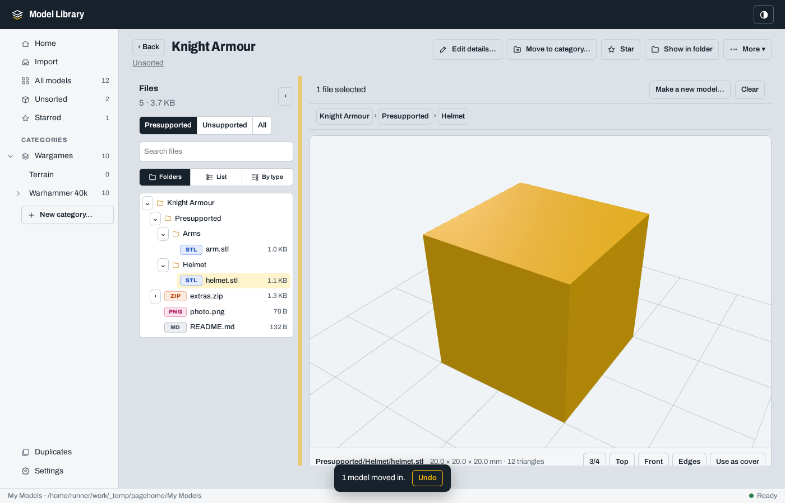
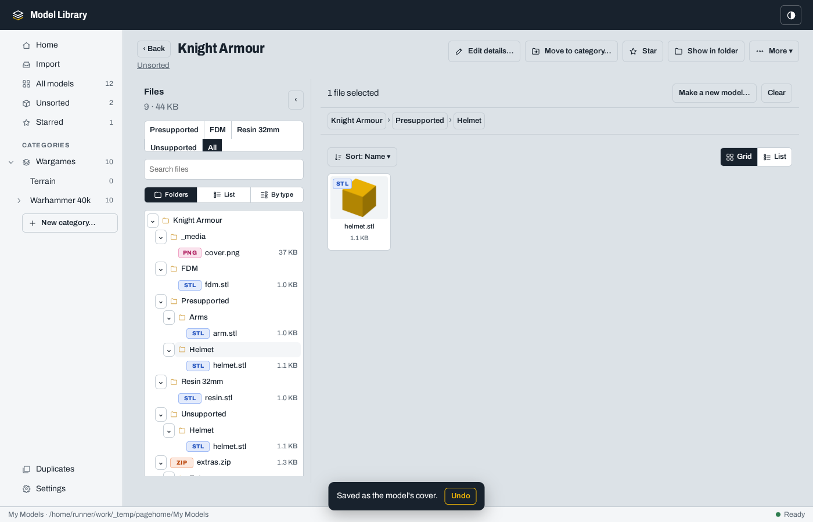
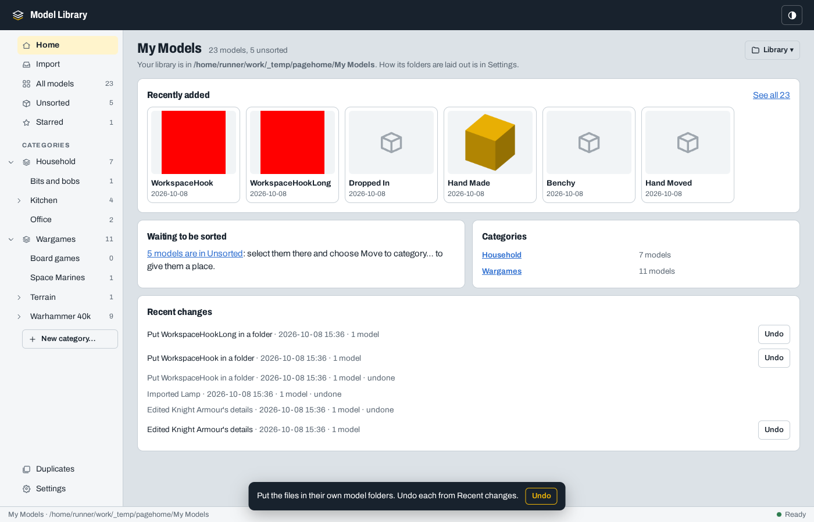

# Model workspace screenshots

Captured by the Linux acceptance suite for release [0.5.5](https://github.com/DrFlGd/Model-Library/releases/tag/v0.5.5), commit `2937a4fed17fb45e2737e7f47ca7605137914d67`. The suite uses small generated model fixtures.

[Release checks](https://github.com/DrFlGd/Model-Library/actions/runs/37801369669): 61 core tests, 89 page checks, Windows and Linux app checks, and cross-platform library portability passed.
